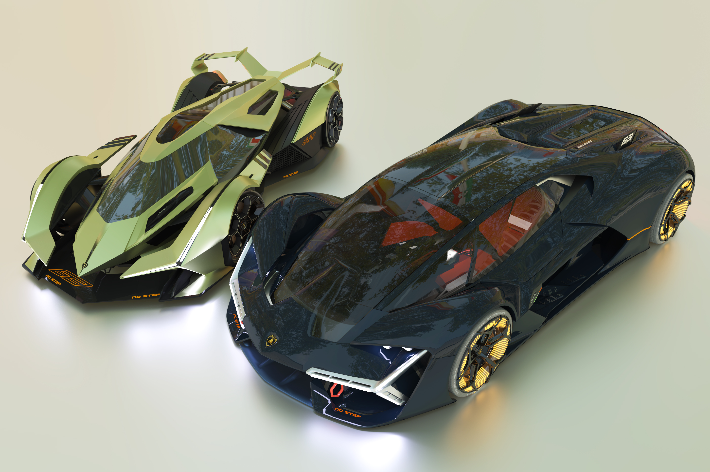
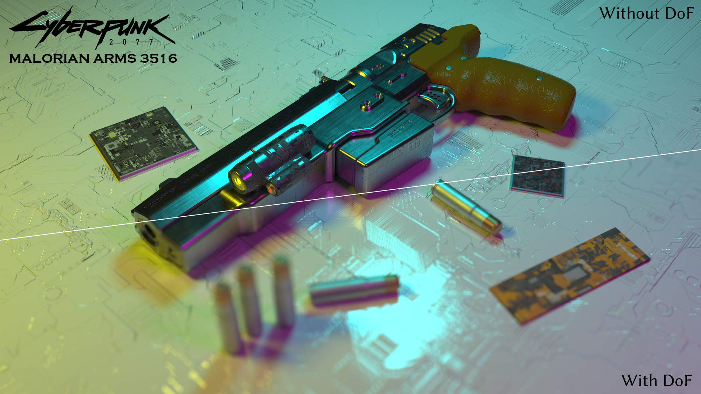
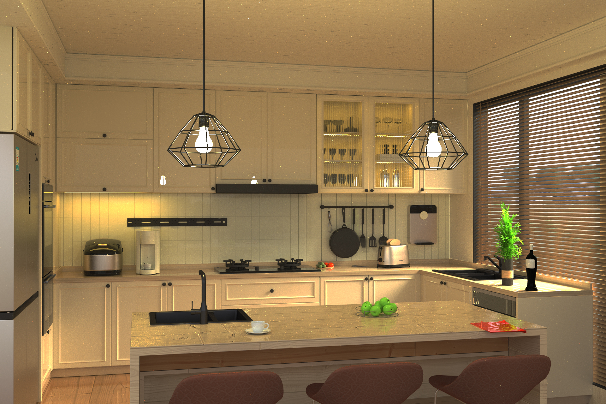
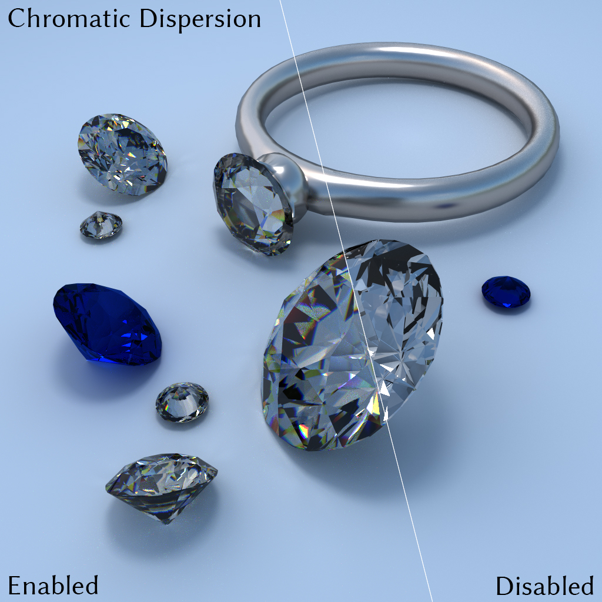
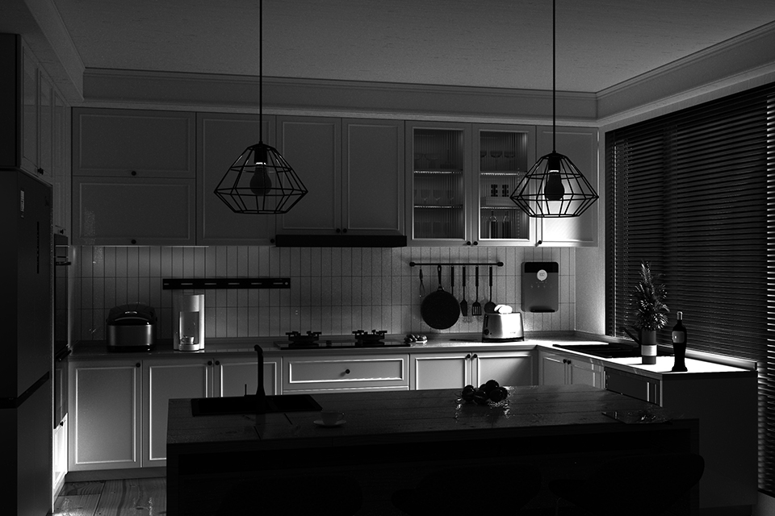
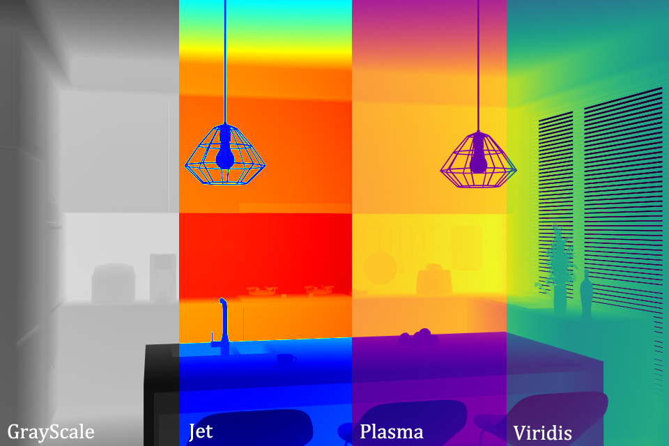

# CUDA-PT
---

**Software** Path Tracing renderer implemented in **CUDA**, **from scratch**.

Distributed parallel rendering supported, via [nanobind](https://github.com/wjakob/nanobind) and PyTorch DDP.









| Variance                           | Depth                   | BVH cost                   |
| ---------------------------------- | ----------------------- | -------------------------- |
|  |  |  |

| Online Param Setter                | Volumetric Path Tracing[^1]            |
| ---------------------------------- | --------------------------- |
| <div align="center"><video src="https://github.com/user-attachments/assets/fc098d93-7acb-4232-8a7e-c39518af2db4"/></div> | <div align="center"><video src="https://github.com/user-attachments/assets/89a5234e-44f7-48a6-bed4-ee2beb6fe7b3"/></div> |
[^1]: The video is offline-rendered with my distributed parallel renderer. The smoke is simulated by Blender and exported to `.nvdb` format for my renderer.
#### Compile & Run

The repo contains several external dependencies, therefore, using the following command:
```
git clone https://github.com/Enigmatisms/cuda-pt.git --recursive
```

##### windows

Dependent on GLEW for the interactive viewer (`./build/xx/cpt`). If GLEW is not installed, only offline application is available (`./build/xx/pt`). GLEW should be manually installed. Initially, this code base can be run on Linux (tested on Ubuntu 22.04) but I haven't try that since the day my Ubuntu machine broke down. Currently, using MSVC (VS2022) with CMake (3.24+):

```shell
mkdir build && cd build
cmake --DCMAKE_BUILD_TYPE=release ..
cmake --build . --config Release --parallel 7 -j 7
```

(`./build/xx/cpt.exe`) and (`./build/xx/pt.exe`) will be the executable files. To run the code, an example is:

```
cd build/Release
./cpt.exe ../../scene/xml/vader.xml
```

Note that, if you have built the code and you have changed the code in `src` afterwards, on windows, you may have to use `./rm_devlink_obj.sh` to delete all the `.device-link.obj` files in the build folder and build it again (it is strange that those compiled `.obj` files won't update, which might cause linking problem).

##### Linux

The following dependencies should be satisfied:

```shell
sudo apt install libglew-dev libwayland-dev libxkbcommon-dev libxrandr-dev libxinerama-dev libxcursor-dev libxi-dev
```

Then run the following command with CMake (3.24+) and make:

```shell
mkdir build && cd build
cmake --DCMAKE_BUILD_TYPE=release ..
make -j7
```

---

##### Test the code

After successfully building the project, you will have three *executables*:

- `pt(.exe)`: Single GPU offline rendering.
- `cpt(.exe)`: Single GPU online rendering, GUI visualization and parameter tweaking.
- `pyrender`: Python import-able: use `help(PythonRenderer)` to see what functionalities can be used.

#### More info

This repo currently **has no plan for OptiX**, since I am experiencing how to build the wheel and make it fast, instead of implementing some useful features. Useful features are incorporated (though now AdaPT is forsaken) in the experimental path tracer AdaPT. Check my github homepage for more information.

Currently, this repo supports:

- [x] Megakernel unidirectional path tracing.
- [x] Wavefront unidirectional path tracing with stream compaction. Currently, WFPT is a bit slower than Megakernel PT.
- [x] GPU volumetric path tracer (Megakernel). Supports homogeneous and grid volume (NanoVDB), with online parameter setters.
- [x] BVH cost visualizer and depth renderer.
- [x] GPU BVH: A stackless GPU surface area heuristic BVH.
- [x] CUDA pitched textures for environment maps, normal, roughness, index of refraction and albedo.
- [x] Online hot reloading of the scene params. Check out the video down below.

##### TODO

- [x] (Recent) An `imgui` based interactive UI.
- [ ] (Around 2025.05, stay tuned) Benchmarking with AdaPT (Taichi lang based renderer) and OptiX (optional). More profiling, and finally, I think I will write several blog posts on "How to implement an efficient software path tracing renderer with CUDA". The blog posts will be more focused on the soft(and hard)-ware related analysis-driven-optimization, so they will actually be posts that summarize (and teach) some best practices for programming the tasks with extremely imbalanced workloads.

##### Tricks (that will be covered in my incoming blog posts)

I've tried a handful of tricks, unfortunately, due to the limitation of time I haven't document any of these (including statistical profiling and analysis) and I currently only have vague (somewhat) concepts of DOs and DON'Ts. Emmm... I really want to summarize all of them, in November, after landing on a good job. So wish me good luck.

- [x] Divergence control part I (loop 'pre-converge')
- [x] Divergence control part II: megakernel or wavefront?
- [x] Stream compaction for WFPT. Shader Execution Reordering (SER) on Ada Lovelace architecture (NVIDIA 40x GPU) (More in-depth reading on this topic, since NVIDIA said almost nothing important in their SER white-book).
- [x] Coalesced access: SoA in WFPT and lg-throttle problem for AoS
- [x] Local memory: dynamic indexing considered harmful
- [x] Dynamic polymorphism: GPU based `variant` or device-side inheritance (virtual functions and their pointers) ?
- [x] Avoiding bank conflicts & Use vectorized load / store
- [x] IMC (constant cache miss): when should you use constant cache
- [x] CPU multi-threading and GPU stream-based concurrency (maybe Hyper-Q).
- [x] (More in-depth reading on this topic) What makes a good GPU based spatially-partitioning data structures (like BVH): well I am no expert in this, should more papers on this topic.

---

## [](https://repography.com) / Recent activity [](https://repography.com)
[](https://github.com/Enigmatisms/cuda-pt/commits)
[](https://github.com/Enigmatisms/cuda-pt/pulls)
[](https://github.com/Enigmatisms/cuda-pt/commits)
[](https://github.com/Enigmatisms/cuda-pt/graphs/contributors)

## [](https://repography.com) / Structure
[](https://github.com/Enigmatisms/cuda-pt)

### Visualizer Notes
- [x] `imgui` has no CMakeLists.txt so we should write it ourselves.
- [x] I think it is painful to use GLEW for windows: after compilation, `glew32.dll` should be manually copied to `Windows/System32`. Also, we should build GLEW manually.
