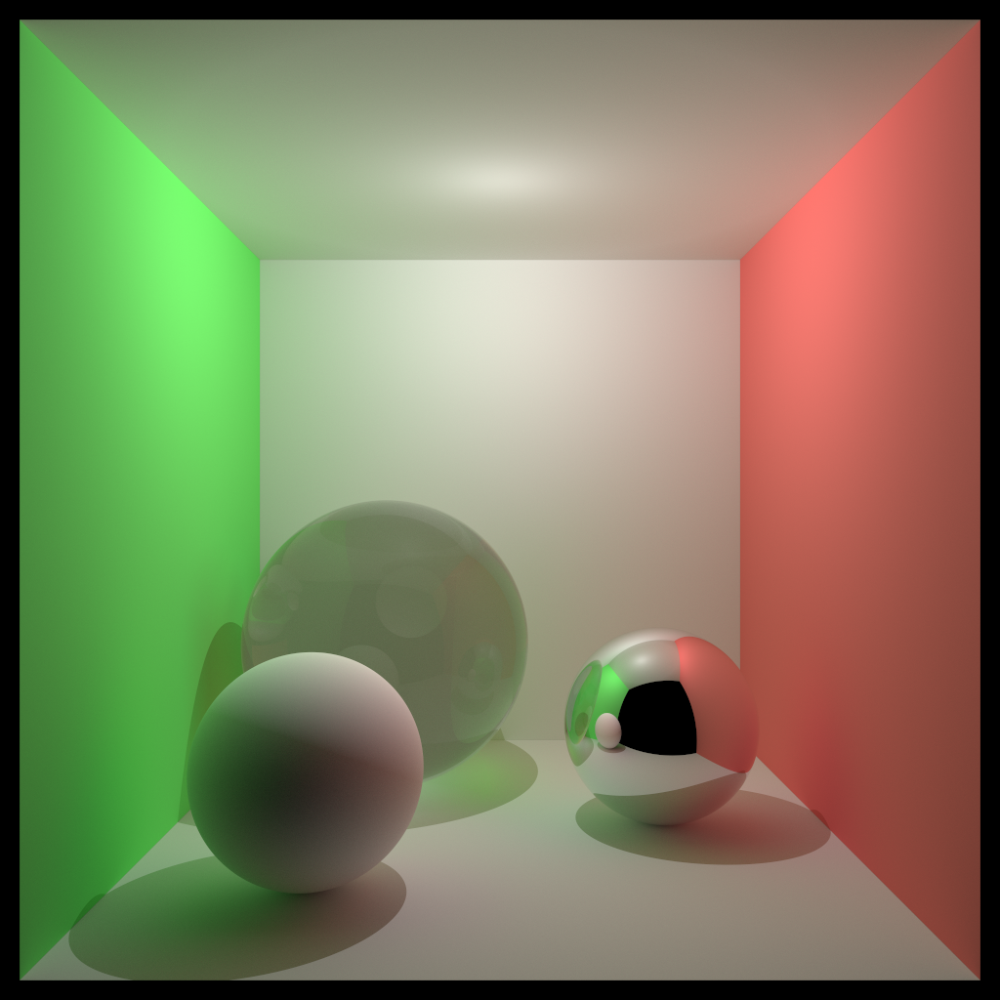
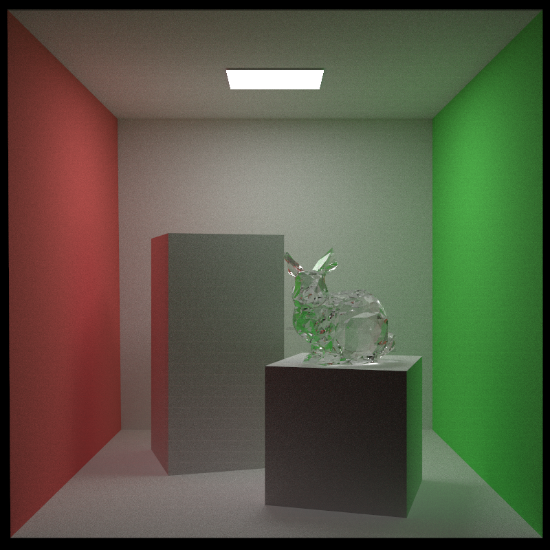

# CUDA-PT
---

Unidirectional Path Tracing implemented in **CUDA**, together with **C++17 traits** and is **templated** whenever possible.

This will definitely be benchmarked with AdaPT and, well CPU based renders like pbrt-v3 (generic accelerators) and tungsten (Intel Embree).

Since I have no intention making this a extensive project (like AdaPT, taking care of all the user-friendly aspect) and I am doing this just to challenge myself for more difficult parallel program design, this repo will not be so user friendly and the scalability will be far worse than that of AdaPT. I will try to keep the chores minimal and focus on heterogeneous program design. 

- [x] Toy CUDA depth renderer with profiling:

- [x] Unidirectional path tracing with AABB culling. Full traversal without spatial partition. In this stage, shared memory and constant memory will be made use of. Special kind of `variant` will be of use (since `std::variant` is not supported by CUDA, for `std::visit` will either crash or be rejected by the compiler). This version of UDPT can be 3-8x faster than my [AdaPT](https://github.com/Enigmatisms/AdaPT) renderer (Taichi lang, JIT CUDA backend).

|Depth Renderer|Unidirection PT|
|:--:|:--:|
|||
|||

- [ ] CUDA texture bindings (with normal or UV maps)
- [ ] GPU side BVH implementation. This will be the most difficult part, since "it is always easy to write your program with parallelism, but difficult to make it fast".

##### shared / constant / texture memory acceleration

- For naive full-traversal based implementation, multiple threads can batch geometries (together with UV-coords, normals, etc.) and copy them to shared memory. Since shared memory is limited (on my device, 49152 Bytes) and we need appropriate number of blocks to occupy the stream processors, batch size should be experimented with.
- constant memory can be used to store object information (color, emission), since it will not occupy too much memory (65536 Bytes constant memory on my device is obviously sufficient).
- texture memory: I have never tried this before. Excited! CUDA texture bindings offer hardware BILERP, amazing.

##### warp level operations & stream multi-processing

For now, not applicable it seems.

##### `variant` based polymorphism

Polymorphism can be easily achieved with virtual functions/classes, yet I don't think this is a good choice for GPU programming: extra `vptr` will 

- Add another global memory access, which can be slow (without possibility to coalesce memory access for fewer memory transactions) 
- Prevent compiler from inlining the function, and the stack procedures for calling a non-inline function can introduce overhead.

Polymorphism based on `variant` (union like type) might avoid the above overhead.

##### Spatial partition

For a scene with complex geometries, BVH (or KD-tree) should be implemented to accelerate ray-intersection. For CPUs, these acceleration structures are easy to implement and can be fast naturally, while for GPUs, branching efficiency and memory access pattern should be carefully considered, in order to run as fast as it can.

---

### Misc

This repo originated from: [w3ntao/smallpt-megakernel](https://github.com/w3ntao/smallpt-megakernel), but now it is very different from it. I answered [his question on stackexchange computer graphics](https://computergraphics.stackexchange.com/questions/14000/why-is-my-ray-tracer-not-accelerated-by-cuda/14003#14003) and tweaked his code, so I thought to myself... why not base on this repo and try to make it better (though, I won't call it small-pt, since it definitely won't be small after I heavily optimize the code).
