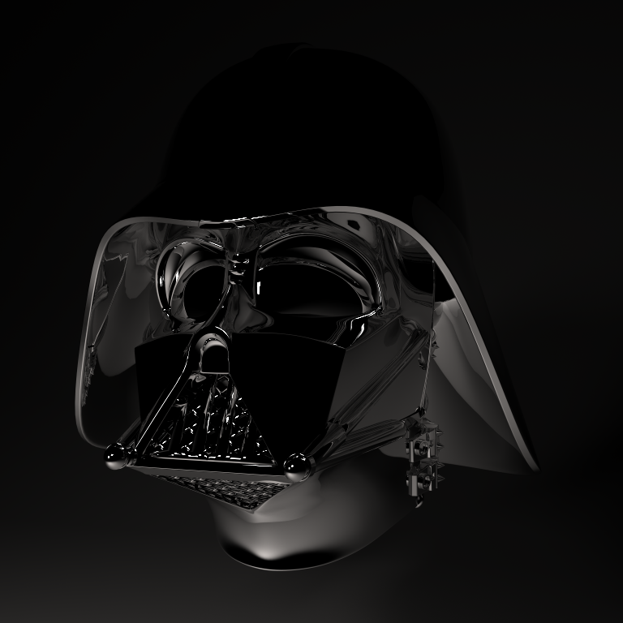
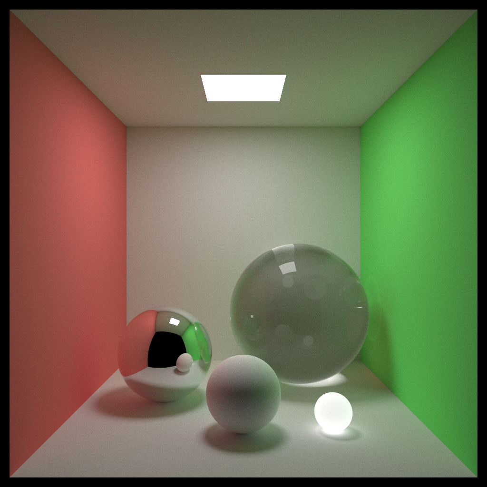
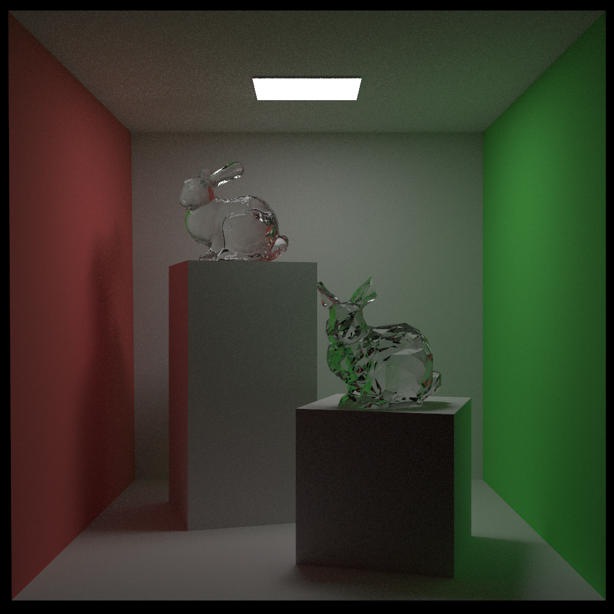

# CUDA-PT
---

Unidirectional Path Tracing implemented in **CUDA**, together with **C++17 traits** and is **templated** whenever possible.

This will definitely be benchmarked with AdaPT and, well CPU based renders like pbrt-v3 (generic accelerators) and tungsten (Intel Embree).

##### Compile & Run

The repo contains several external dependencies, therefore, using the following command:
```
git clone https://github.com/Enigmatisms/cuda-pt.git --recursive
```

Dependent on GLEW for the interactive viewer (`./build/xx/cpt`). If GLEW is not installed, only offline application is available (`./build/xx/pt`). Initially, this code base can be run on Linux (tested on Ubuntu 22.04) but I haven't try that since the day my Ubuntu machine broke down. Currently, using MSVC (VS2022) with CMake:
```shell
mkdir build && cd build
cmake --DCMAKE_BUILD_TYPE=release ..
cmake --build . --config Release
```

(`./build/xx/cpt.exe`) and (`./build/xx/pt.exe`) will be the executable files. To run the code, an example is:

```
cd build/Release
./cpt.exe ../../scene/xml/bunny.xml
```

##### More info
 
This repo currently **has no plan for OptiX**, since I am experiencing how to build the wheel and make it fast, instead of implementing some useful features. Useful features are incorporated in the experimental path tracer AdaPT. Check my github homepage for more information.

The scalability of this repo might be worse than that of AdaPT, but it will improve over time, since I plan to migrate from Taichi Lang to a pure-CUDA code base. Currently, this repo supports:

- [x] Toy CUDA depth renderer with profiling
- [x] Megakernel unidirectional path tracing. Two major ray-scene intersection schemes are employed: shared-memory based AABB culling, and GPU BVH (see below).
- [x] Wavefront unidirectional path tracing with stream compaction. Currently, WFPT is not as fast as megakernel PT due to the simplicity of the test scenes (and maybe, coalesced GMEM access problems, being working on this).
- [x] GPU BVH: A stackless GPU surface area heuristic BVH. The current implementation is not optimal (since the ordering of left-child and right child is left unaccounted for, and there is no 'look-back' op), but fast enough. Profiling for this part is not every complete. 1D CUDA texture is used to store the BVH nodes, for better cache performance.

|Unidirectional PT|Unidirectional PT|
|:--:|:--:|
|||
|||


<div align="center">
  <video src="https://github.com/user-attachments/assets/2b3121b9-d3d6-4c07-b0e5-65803de78078"/>
</div>


##### TODO

- [x] (Recent) An `imgui` based interactive UI.
- [ ] (Around 2024.11, stay tuned) Benchmarking with AdaPT (Taichi lang based renderer) and OptiX (optional). More profiling, and finally, I think I will write several blog posts on "How to implement an efficient software path tracing renderer with CUDA". The blog posts will be more focused on the soft(and hard)-ware related analysis-driven-optimization, so they will actually be posts that summarize (and teach) some best practices for programming the tasks with extremely imbalanced workloads.
- [ ] CUDA texture for texture mapping. I have UV, but I didn't write texture loading currently. What a sad state of affairs.

##### Tricks (that will be covered in my incoming blog posts)

I've tried a handful of tricks, unfortunately, due to the limitation of time I haven't document any of these (including statistical profiling and analysis) and I currently only have vague (somewhat) concepts of DOs and DON'Ts. Emmm... I really want to summarize all of them, in November, after landing on a good job. So wish me good luck.

- [x] Divergence control part I (loop 'pre-converge')
- [x] Divergence control part II: megakernel or wavefront? 
- [x] Stream compaction for WFPT. Shader Execution Reordering (SER) on Ada Lovelace architecture (NVIDIA 40x GPU) (More in-depth reading on this topic, since NVIDIA said almost nothing important in their SER white-book).
- [x] Coalesced access: SoA in WFPT and lg-throttle problem for AoS
- [x] Local memory: dynamic indexing considered harmful
- [x] Dynamic polymorphism: GPU based `variant` or device-side inheritance (virtual functions and their pointers) ?
- [x] Avoiding bank conflicts & Use vectorized load / store
- [x] IMC (constant cache miss): when should you use constant cache
- [x] CPU multi-threading and GPU stream-based concurrency (maybe Hyper-Q).
- [ ] (More in-depth reading on this topic) What makes a good GPU based spatially-partitioning data structures (like BVH): well I am no expert in this, should more papers on this topic.

---

### Visualizer Notes
- [x] `imgui` has no CMakeLists.txt so we should write it ourselves.
- [x] I think it is painful to use GLEW for windows: after compilation, `glew32.dll` should be manually copied to `Windows/System32`. Also, we should build GLEW manually.   

### Misc

This repo originated from: [w3ntao/smallpt-megakernel](https://github.com/w3ntao/smallpt-megakernel), but now it is very different from it. I answered [his question on stackexchange computer graphics](https://computergraphics.stackexchange.com/questions/14000/why-is-my-ray-tracer-not-accelerated-by-cuda/14003#14003) and tweaked his code, so I thought to myself... why not base on this repo and try to make it better (though, I won't call it small-pt, since it definitely won't be small after I heavily optimize the code).
